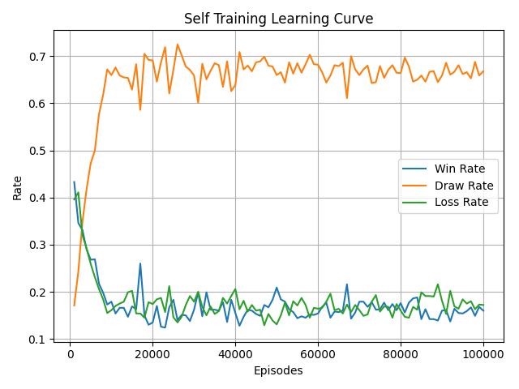
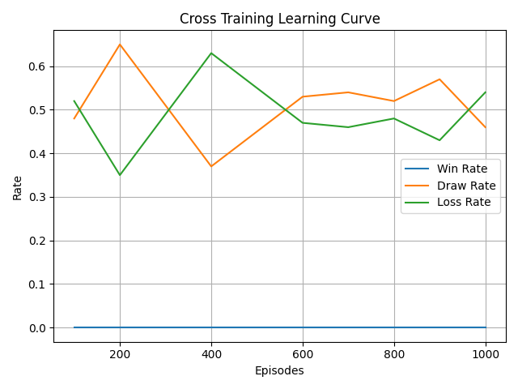
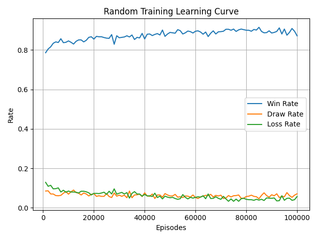

# Tic-Tac-Toe-Bot

## About
This project aims to create a Tic Tac Toe Bot using Reinforcement Learning. 

## Installation and Running the Code

Set up the python virtual environment if this is your first time running the code.
```
python -m venv .venv
```

Set running script to be enabled in your system. 
```
Set-ExecutionPolicy -Scope Process -ExecutionPolicy Bypass
```

Activate the python virtual environment
```
.venv\Scripts\activate
```

Install the python libraries.
```
pip install -r requirements.txt
```

Run the code
```
python -m src.main
```

After you are done, deactivate the python virtal environment
```
deactivate
```

## Training the Model

Follow the steps in [Installation and Running the Code](#installation-and-running-the-code), but stop before running the code. 

Then, run the training code.
```
python -m src.train
```

After you are done, deactivate the python virtal environment
```
deactivate
```

## Methodology

The Tic Tac Toe Bot is created using Q Learning, with its data stored using a dictionary and application of the Bellman's Equation: 
```math
Q(s, a) \leftarrow Q(s, a) + \alpha \left[ r + \gamma \max_{a'} Q(s', a') - Q(s, a) \right]
```

The Tic Tac Toe Bot is trained in three stages, playing against itself, playing against a bot implemented using Minimax Algorithm with Alpha Beta Pruning and plyaing against a random bot. The first stage aims to diversify and train the bot against an average player while the second stage aims to train the bot against an excellent player. The last stage aims to diversify the bot data, allowing it to have more varaitions in its model. 

## Discussion

The performance of this Tic Tac Toe Bot performed relatively well. When runned against default test cases for 100 times, the total failure rate of the bot is about 19.34%, which indicates that it correctly layout wins and blocks 80% of the time. However, one reason for this high failure rate may be due to the lack of training for the bot to factor into account faster win, which is what one of the test case is about. 

Regarding the training of the Tic Tac Toe Bot, it trains relatively well against itself, having constant improvements in the draw rates over time. Against a random bot, it also performed relatively well, having a constant improvement in its win rates. However, when playing against Minimax Bot, the agent training does not seem to improve as much, perhaps due to the low training attempts (1000 against 100000 due to the long time the Minimax Bot takes to make decisions). 

The Self Training, Cross Training and Random Training Learning Curves are shown respectively below: 






## Acknowledgement

I would like to express my thanks to the following resources:

- [**Reinforcement Learning - Implement Tic Tac Toe**](https://towardsdatascience.com/reinforcement-learning-implement-tictactoe-189582bea542/) and [**Reinforcement Learning Made Simply: Build a Q Learning Agent in Python**](https://towardsdatascience.com/reinforcement-learning-made-simple-build-a-q-learning-agent-in-python/): The articles are used as inspiration and reference for this project
- [**Implement the Minimax Algorithm for AI in python**](https://www.datacamp.com/tutorial/minimax-algorithm-for-ai-in-python): This article helped me to learn the Minimax Algorithm
